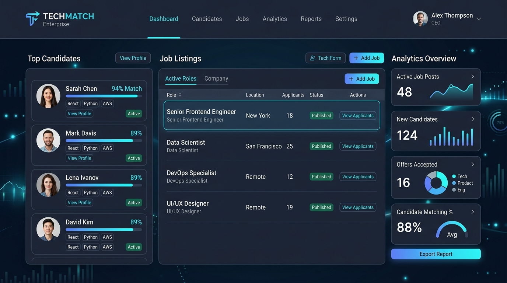

<div align="center">

  

  <br/><br/>

  <a href="#-interactive-quick-start">
    
  </a>
  <a href="docs/API_REFERENCE.md">
    
  </a>
  <a href="docs/DATABASE_SCHEMA.md">
    
  </a>
  <a href="https://github.com/asad594/bytecorp-training-tasks/releases/download/srs-v1.0/SRS_Job_board.1.pdf">
    
  </a>

  <br/><br/>

  [](https://python.org)
  [](https://djangoproject.com)
  [](https://www.django-rest-framework.org)
  [](https://react.dev)
  [](https://vitejs.dev)
  [](https://tailwindcss.com)
  [](https://payloadcms.com)
  [](https://nextjs.org)
  [](https://www.postgresql.org)
  [](LICENSE)

  <br/><br/>

  <p align="center">
    <b>A modern, decoupled, multi-tier recruitment and career management platform built during the ByteCorp Traineeship Program.</b><br/>
    Featuring role-based authentication, structured observability with isolated database routing, dynamic job search and filtering, headless CMS editorial controls, and interactive application pipelines.
  </p>

  

</div>

---

## 🧭 Interactive Table of Contents

- [🌟 Platform Overview](#-platform-overview)
- [⚡ Interactive Quick Start](#-interactive-quick-start)
- [🏛 System Architecture](#-system-architecture)
- [🔄 Operational Workflows](#-operational-workflows)
- [📊 Relational Data Model & ERD](#-relational-data-model--erd)
- [📡 API Catalog & Endpoints](#-api-catalog--endpoints)
- [🔍 Observability & Production Logging](#-observability--production-logging)
- [🧪 Postman Testing Suite](#-postman-testing-suite)
- [📄 Software Requirements Specification (SRS)](#-software-requirements-specification-srs)

---

## 🌟 Platform Overview

The **ByteCorp Job Board Platform** is a fullstack recruitment system designed with enterprise architectural patterns:

- 👨‍💻 **Candidate Experience**: Filter jobs by tags, skills, location, and salary; submit applications with resumes; track status in real-time.
- 🏢 **Employer Experience**: Register companies, post verified openings, screen applicants, download resumes, and manage hiring stages.
- 🛡 **Admin Moderation**: Superuser analytics, company verification gates, user ban controls, and system health monitoring.
- 📑 **Headless CMS Engine**: Powered by Payload CMS 3 and Next.js 16 for marketing pages, announcements, and content authoring.
- 📈 **Isolated Observability**: Dual-database routing sends structured JSON request logs to a dedicated PostgreSQL database without burdening transactional queries.

---

## ⚡ Interactive Quick Start

<details open>
<summary><b>🚀 Run All Services Concurrently (Recommended)</b></summary>

The project includes root orchestration via `concurrently` to boot the Django API, React frontend, and Payload CMS together:

```bash
# 1. Clone repository
git clone https://github.com/asad594/bytecorp-training-tasks.git
cd bytecorp-training-tasks

# 2. Install orchestration dependencies
npm install

# 3. Boot all services simultaneously
npm run dev
```

| Service | Address | Default Port | Description |
| :--- | :--- | :--- | :--- |
| **Backend API** | `http://localhost:8000/api/v1/` | `8000` | Django 6 REST Framework API |
| **Frontend Portal** | `http://localhost:5173/` | `5173` | React 19 + Tailwind CSS UI |
| **Payload CMS** | `http://localhost:3000/admin/` | `3000` | Next.js 16 + Payload CMS Admin |

</details>

<details>
<summary><b>🐍 Individual Backend Setup (Django 6 & DRF)</b></summary>

```bash
cd backend

# Create and activate virtualenv
python -m venv venv
# Windows:
.\venv\Scripts\activate
# Linux/macOS:
source venv/bin/activate

# Install requirements
pip install -r requirements.txt

# Run migrations (Primary DB + Logs DB)
python manage.py migrate
python manage.py migrate --database=logs_db

# Create admin user & start server
python manage.py createsuperuser
python manage.py runserver
```

</details>

<details>
<summary><b>⚛️ Individual Frontend Setup (React 19 & Vite 8)</b></summary>

```bash
cd frontend
npm install
npm run dev
```

The React portal will be live at `http://localhost:5173`.

</details>

<details>
<summary><b>📝 Individual CMS Setup (Payload CMS 3 & Next.js 16)</b></summary>

```bash
cd cms
pnpm install
pnpm dev
```

The CMS panel will be live at `http://localhost:3000/admin`.

</details>

---

## 🏛 System Architecture

The platform follows a clean 3-tier decoupled architecture:

<div align="center">
  
</div>

<details>
<summary><b>🔍 View Architecture Deep Dive</b></summary>

- **Presentation Layer**: Built with React 19, TanStack Query 5, and Tailwind CSS v4 for reactive, optimistic UI updates.
- **Application Layer**: Django 6 with Django REST Framework, SimpleJWT for token rotation, and centralized URL endpoints registry (`config/endpoints.py`).
- **Data & Observability Layer**:
  - `default` PostgreSQL database for ACID domain transactions.
  - `logs_db` PostgreSQL database for zero-overhead JSON request log ingestion routed via `LoggingRouter`.
  - Media storage for candidate resumes and employer branding.

For complete architectural specifications, see **[System Architecture Guide](docs/ARCHITECTURE.md)**.

</details>
