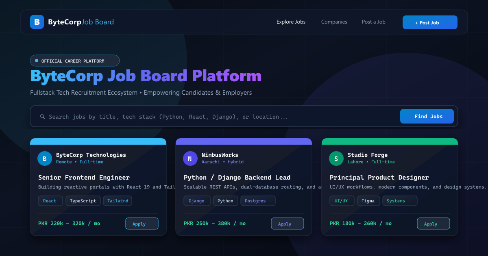
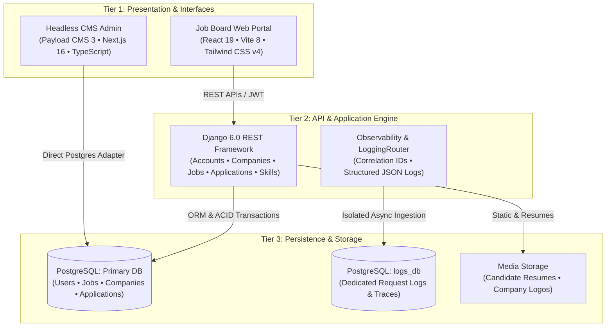
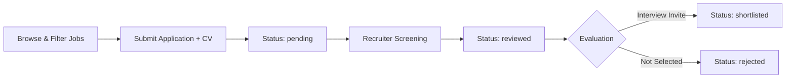
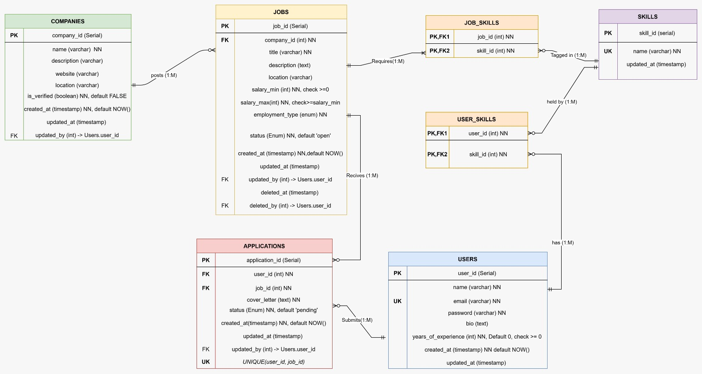

<div align="center">

  

  <br/><br/>

  <a href="#-interactive-quick-start">
    
  </a>
  <a href="docs/API_REFERENCE.md">
    
  </a>
  <a href="docs/DATABASE_SCHEMA.md">
    
  </a>
  <a href="https://github.com/asad594/bytecorp-training-tasks/releases/download/srs-v1.0/SRS_Job_board.1.pdf">
    
  </a>

  <br/><br/>

  [](https://python.org)
  [](https://djangoproject.com)
  [](https://www.django-rest-framework.org)
  [](https://react.dev)
  [](https://vitejs.dev)
  [](https://tailwindcss.com)
  [](https://payloadcms.com)
  [](https://nextjs.org)
  [](https://www.postgresql.org)
  [](LICENSE)

  <br/><br/>

  <p align="center">
    <b>A modern, decoupled, multi-tier recruitment and career management ecosystem engineered during the ByteCorp Traineeship Program.</b><br/>
    Featuring role-based authentication, structured observability with isolated database routing, dynamic job search and filtering, headless CMS editorial controls, and interactive application pipelines.
  </p>

</div>

---

## 🧭 Interactive Table of Contents

- [🌟 Platform Overview](#-platform-overview)
- [⚡ Interactive Quick Start](#-interactive-quick-start)
- [🏛 System Architecture](#-system-architecture)
- [🔄 Operational Workflows](#-operational-workflows)
- [📊 Relational Data Model & ERD](#-relational-data-model--erd)
- [🔐 Role-Based Access Control (RBAC)](#-role-based-access-control-rbac)
- [📡 Interactive API Explorer](#-interactive-api-explorer)
- [🔍 Observability & Production Logging](#-observability--production-logging)
- [🧪 Postman Testing Suite](#-postman-testing-suite)
- [📋 Traineeship Milestones & Feature Checklist](#-traineeship-milestones--feature-checklist)
- [📄 Software Requirements Specification (SRS)](#-software-requirements-specification-srs)
- [❓ Frequently Asked Questions & Troubleshooting](#-frequently-asked-questions--troubleshooting)

---

## 🌟 Platform Overview

The **ByteCorp Job Board Platform** is a fullstack recruitment system designed with enterprise architectural patterns:

- 👨‍💻 **Candidate Experience**: Filter jobs by tags, skills, location, and salary; submit applications with custom cover letters and resumes; track progress in real-time.
- 🏢 **Employer Experience**: Register companies, post verified openings, screen applicants, download candidate CVs, and manage hiring pipeline states.
- 🛡 **Admin Moderation**: Superuser analytics dashboard, company verification gates, user ban controls, and system health monitoring.
- 📑 **Headless CMS Engine**: Powered by Payload CMS 3 and Next.js 16 for marketing pages, articles, and content authoring.
- 📈 **Isolated Observability**: Dual-database routing sends structured JSON request logs to a dedicated PostgreSQL database without burdening transactional queries.

---

## ⚡ Interactive Quick Start

<details open>
<summary><b>🚀 Run All Services Concurrently (Recommended)</b></summary>

The project includes root orchestration via `concurrently` to boot the Django API, React frontend, and Payload CMS together:

```bash
# 1. Clone repository
git clone https://github.com/asad594/bytecorp-training-tasks.git
cd bytecorp-training-tasks

# 2. Install orchestration dependencies
npm install

# 3. Boot all services simultaneously
npm run dev
```

| Service | Address | Default Port | Description |
| :--- | :--- | :--- | :--- |
| **Backend API** | `http://localhost:8000/api/v1/` | `8000` | Django 6 REST Framework API |
| **Frontend Portal** | `http://localhost:5173/` | `5173` | React 19 + Tailwind CSS UI |
| **Payload CMS** | `http://localhost:3000/admin/` | `3000` | Next.js 16 + Payload CMS Admin |

</details>

<details>
<summary><b>🐍 Individual Backend Setup (Django 6 & DRF)</b></summary>

```bash
cd backend

# Create and activate virtualenv
python -m venv venv
# Windows:
.\venv\Scripts\activate
# Linux/macOS:
source venv/bin/activate

# Install requirements
pip install -r requirements.txt

# Run migrations (Primary DB + Logs DB)
python manage.py migrate
python manage.py migrate --database=logs_db

# Create admin user & start server
python manage.py createsuperuser
python manage.py runserver
```

</details>

<details>
<summary><b>⚛️ Individual Frontend Setup (React 19 & Vite 8)</b></summary>

```bash
cd frontend
npm install
npm run dev
```

The React portal will be live at `http://localhost:5173`.

</details>

<details>
<summary><b>📝 Individual CMS Setup (Payload CMS 3 & Next.js 16)</b></summary>

```bash
cd cms
pnpm install
pnpm dev
```

The CMS panel will be live at `http://localhost:3000/admin`.

</details>

---

## 🏛 System Architecture

The platform follows a decoupled, 3-tier enterprise architecture:



<details>
<summary><b>🔍 View Architecture Deep Dive</b></summary>

- **Presentation Layer**: Built with React 19, TanStack Query 5, and Tailwind CSS v4 for reactive, optimistic UI updates.
- **Application Layer**: Django 6 with Django REST Framework, SimpleJWT for token rotation, and centralized URL endpoints registry (`config/endpoints.py`).
- **Data & Observability Layer**:
  - `default` PostgreSQL database for ACID domain transactions.
  - `logs_db` PostgreSQL database for zero-overhead JSON request log ingestion routed via `LoggingRouter`.
  - Media storage for candidate resumes and employer branding.

For complete architectural specifications, see **[System Architecture Guide](docs/ARCHITECTURE.md)**.

</details>

---

## 🔄 Operational Workflows

### Candidate Discovery & Application Pipeline



<details>
<summary><b>📋 View Application State Machine Details</b></summary>

```
[ pending ] ──────► [ reviewed ] ──────► [ shortlisted ]
                         │
                         └─────────────► [ rejected ]
```

1. **`pending`**: Candidate submits an application with cover letter and resume upload.
2. **`reviewed`**: Employer views candidate profile and inspects qualifications.
3. **`shortlisted`**: Recruiter advances candidate to technical interviews.
4. **`rejected`**: Polite outcome notification sent to candidate.

See **[Workflows & Lifecycles Guide](docs/WORKFLOWS.md)** for exhaustive details.

</details>

---

## 📊 Relational Data Model & ERD

The database architecture is designed in PostgreSQL with strict foreign keys, cascade rules, and check constraints:

<div align="center">
  
</div>

<details>
<summary><b>📑 View Schema Highlights & PostgreSQL ENUMs</b></summary>

- **Role Enum**: `user_role_enum` (`job_seeker`, `company_rep`)
- **Employment Enum**: `employment_type_enum` (`full-time`, `part-time`, `contract`)
- **Job Status Enum**: `job_status_enum` (`open`, `closed`, `draft`)
- **Application Status Enum**: `application_status_enum` (`pending`, `reviewed`, `shortlisted`, `rejected`)
- **Constraints**:
  - `years_of_experience >= 0`
  - `salary_min >= 0`
  - `salary_max >= salary_min`
  - `UNIQUE (user_id, job_id)` prevents duplicate applications by the same seeker.

For SQL table definitions and index strategies, consult **[Database Schema Documentation](docs/DATABASE_SCHEMA.md)**.

</details>

---

## 🔐 Role-Based Access Control (RBAC)

The platform enforces fine-grained permissions across three user personas:

| Capability / Resource | 👨‍💻 Job Seeker | 🏢 Company Rep | 🛡 Admin |
| :--- | :---: | :---: | :---: |
| Search & Browse Open Jobs | ✅ | ✅ | ✅ |
| Submit Job Applications with CV | ✅ | ❌ | ❌ |
| Manage Personal Candidate Profile & Skills | ✅ | ❌ | ❌ |
| Create & Manage Company Profile | ❌ | ✅ | ✅ |
| Post, Edit, and Close Job Openings | ❌ | ✅ | ✅ |
| Screen Applicants & Update Pipeline Status | ❌ | ✅ | ✅ |
| Approve / Verify Pending Companies | ❌ | ❌ | ✅ |
| Ban / Unban Users & Companies | ❌ | ❌ | ✅ |
| View System Metrics & Platform Analytics | ❌ | ❌ | ✅ |

---

## 📡 Interactive API Explorer

All endpoints are organized under `/api/v1/` and defined in `backend/config/endpoints.py`:

<details open>
<summary><b>🔑 Accounts & Authentication Endpoints</b></summary>

| HTTP | Fragment | Purpose | Auth |
| :--- | :--- | :--- | :--- |
| `POST` | `/api/v1/accounts/register/job_seeker/` | Candidate self-registration | Public |
| `POST` | `/api/v1/accounts/register/company_rep/` | Recruiter self-registration | Public |
| `POST` | `/api/v1/accounts/login/job_seeker/` | Candidate JWT token exchange | Public |
| `POST` | `/api/v1/accounts/login/company_rep/` | Recruiter JWT token exchange | Public |
| `POST` | `/api/v1/accounts/login/admin/` | Superuser administrative login | Public |
| `POST` | `/api/v1/accounts/auth/google/` | Google OAuth 2.0 social sign-in | Public |
| `POST` | `/api/v1/accounts/token/refresh/` | Refresh expired access tokens | Public |
| `GET` | `/api/v1/accounts/profile/` | Fetch authenticated profile | Bearer JWT |

</details>

<details>
<summary><b>🏢 Company & Recruiter Endpoints</b></summary>

| HTTP | Fragment | Purpose | Auth |
| :--- | :--- | :--- | :--- |
| `GET` | `/api/v1/companies/` | List verified company directories | Public |
| `POST` | `/api/v1/companies/` | Create a new company profile | Company Rep |
| `GET` | `/api/v1/companies/me/` | Retrieve current rep's company | Company Rep |
| `POST` | `/api/v1/companies/join/` | Request affiliation with company | Company Rep |
| `GET` | `/api/v1/companies/pending/` | Review unverified registrations | Admin |
| `POST` | `/api/v1/companies/<id>/verify/` | Verify and approve company | Admin |
| `POST` | `/api/v1/companies/<id>/ban/` | Suspend or ban company | Admin |

</details>

<details>
<summary><b>💼 Jobs & Applications Endpoints</b></summary>

| HTTP | Fragment | Purpose | Auth |
| :--- | :--- | :--- | :--- |
| `GET` | `/api/v1/jobs/` | Search jobs with filters | Public |
| `POST` | `/api/v1/jobs/` | Post a new job opportunity | Company Rep |
| `GET` | `/api/v1/jobs/<id>/` | View complete job details | Public |
| `GET` | `/api/v1/job-applications/` | List candidate's submissions | Job Seeker |
| `POST` | `/api/v1/job-applications/` | Submit application with CV | Job Seeker |
| `GET` | `/api/v1/job-applications/company/` | View received applications | Company Rep |
| `PATCH`| `/api/v1/job-applications/<id>/` | Update review/shortlist status | Company Rep |

</details>

For complete parameter specifications, payloads, and responses, see **[REST API Reference](docs/API_REFERENCE.md)**.

---

## 🔍 Observability & Production Logging

<details>
<summary><b>📊 View Observability Architecture</b></summary>

- **Structured JSON Formatting**: Emitted via `pythonjsonlogger.jsonlogger.JsonFormatter` for compatibility with log ingestors.
- **Request Tracing**: Every request is assigned a `correlation_id` UUID generated in `RequestLoggingMiddleware`.
- **Database Segregation**: Logs are committed to `logs_db` using `LoggingRouter`, ensuring main transactional workloads remain fast and unencumbered.
- **Unified Error Handling**: Unhandled exceptions and validation errors are intercepted by `custom_exception_handler` for standardized error reporting.

Read more in **[Observability & Logging Specifications](docs/OBSERVABILITY.md)**.

</details>

---

## 🧪 Postman Testing Suite

A complete Postman workspace is included in `backend/postman/`:

- 📦 **Collection**: [`JobBoard_Postman_Collection.json`](backend/postman/JobBoard_Postman_Collection.json)
- 🌐 **Environment**: [`JobBoard_Postman_Environment.json`](backend/postman/JobBoard_Postman_Environment.json)

```bash
# Optional automated execution via Newman
newman run backend/postman/JobBoard_Postman_Collection.json \
  -e backend/postman/JobBoard_Postman_Environment.json
```

---

## 📋 Traineeship Milestones & Feature Checklist

- [x] **Phase 1: Relational Database Design**
  - [x] Normalized 3NF PostgreSQL database schema (`Task 1/Schema.sql`)
  - [x] Comprehensive ERD diagram (`docs/assets/erd.png`)
  - [x] Optimized B-tree, composite, and partial indexing (`Task 1/Indexes.sql`)
- [x] **Phase 2: Backend Architecture & REST APIs**
  - [x] Django 6 REST Framework modular design (`accounts`, `companies`, `jobs`, `job_applications`, `skills`)
  - [x] SimpleJWT authentication, Google OAuth, password reset
  - [x] Multi-database router with dedicated `logs_db` observability store
  - [x] Centralized API endpoints registry (`config/endpoints.py`)
  - [x] Postman collections & automated test suites
- [x] **Phase 3: Frontend & Headless CMS**
  - [x] Modern React 19 SPA with Tailwind CSS v4 and Vite 8
  - [x] TanStack React Query 5 data caching & optimistic mutations
  - [x] Payload CMS 3 integration with Next.js 16 and PostgreSQL adapter
  - [x] Unified root developer execution via `concurrently`

---

## 📄 Software Requirements Specification (SRS)

The full formal specifications governing this platform are available for download:
- 📥 **[Download Software Requirements Specification (SRS v1.0, PDF)](https://github.com/asad594/bytecorp-training-tasks/releases/download/srs-v1.0/SRS_Job_board.1.pdf)**

---

## ❓ Frequently Asked Questions & Troubleshooting

<details>
<summary><b>1. How do I resolve PostgreSQL connection errors?</b></summary>
Ensure PostgreSQL is active and create both target databases:

```sql
CREATE DATABASE jobboard_db;
CREATE DATABASE jobboard_logs_db;
```

Update your `backend/.env` with matching credentials.
</details>

<details>
<summary><b>2. Why are migrations split across two databases?</b></summary>
The observability suite stores structured `RequestLog` entries in `logs_db` to isolate logging writes from application database locks:

```bash
python manage.py migrate
python manage.py migrate --database=logs_db
```
</details>

<details>
<summary><b>3. What Node version is required for Payload CMS 3?</b></summary>
Payload 3 requires Node.js >= 24.15.0 and `pnpm`. If running an older Node version, run the backend and frontend separately.
</details>

---

<div align="center">
  <sub>Built with ❤️ during the ByteCorp Traineeship Program • Maintained by <a href="https://github.com/asad594">@asad594</a></sub>
</div>
