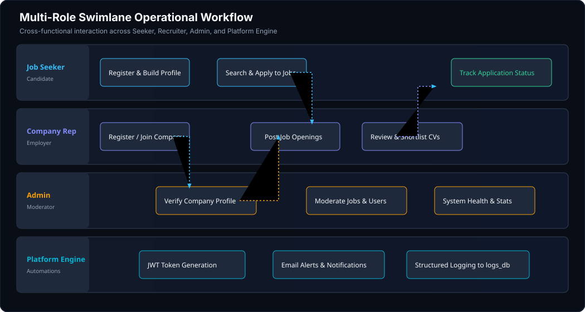

# Recruitment & Operational Workflows

This document outlines the end-to-end user journeys, status transition rules, and swimlane workflows powering the **ByteCorp Job Board Platform**.

---

## 🔄 Job Application Lifecycle


### State Machine Transition Rules

The application status follows a strict finite-state progression:

```
[ pending ] ──────► [ reviewed ] ──────► [ shortlisted ]
                         │
                         └─────────────► [ rejected ]
```

| State | Allowed Transitions | Trigger / Responsible Actor | Side Effects |
| :--- | :--- | :--- | :--- |
| `pending` | `reviewed` | Candidate submits application (`POST /api/v1/job-applications/`) | Resume validated & stored in media root; candidate notification queued |
| `reviewed` | `shortlisted`, `rejected` | Recruiter views candidate profile & downloads resume (`GET /api/v1/job-applications/{id}/`) | Activity logged to `logs_db` with candidate correlation ID |
| `shortlisted` | *(Terminal)* | Recruiter marks candidate for interview | Candidate receives shortlisting alert email |
| `rejected` | *(Terminal)* | Recruiter marks application not selected | Candidate receives polite feedback notification |

---

## 🏊 Multi-Role Operational Swimlane



### Role Responsibilities & Boundary Matrix

1. **Job Seeker**:
   - Register account & set up candidate bio and skills (`USER_SKILLS`).
   - Search published job listings with dynamic multi-criteria filters (salary, employment type, location, required skills).
   - Apply with dedicated cover letter and resume upload.
   - Monitor real-time status changes in personal applicant portal.

2. **Company Representative**:
   - Register account & either create a company or request to join existing organization.
   - Wait for Admin verification (`is_verified = true`).
   - Create, edit, and close job postings tagged with required technical skills.
   - Review incoming applications, download resumes, and transition candidate statuses.

3. **Platform Administrator**:
   - Review pending company verification requests (`/api/v1/companies/pending/`).
   - Verify or ban fraudulent companies and abusive users.
   - Monitor system-wide analytics, job counts, active applicants, and server health.

4. **Platform Engine**:
   - Issue and verify JSON Web Tokens (Access + Refresh tokens).
   - Trace all requests with unique correlation UUIDs.
   - Ingest structured logs to separate PostgreSQL `logs_db`.
